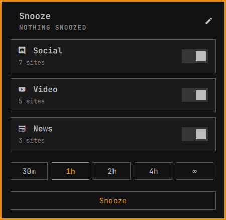
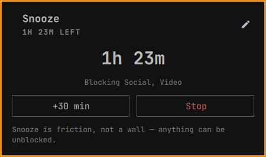
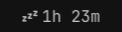
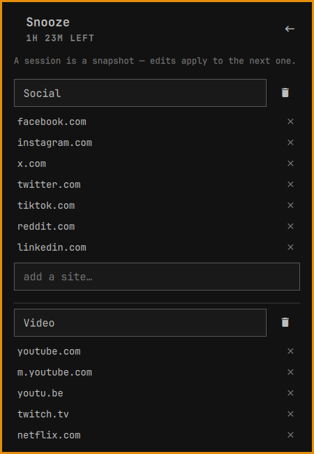

# Snooze


A bar widget for [Omarchy](https://omarchy.org). Pick the groups you want out
of the way, pick a duration, and Snooze writes a marked block of `0.0.0.0`
entries into `/etc/hosts` — then takes it out again when the time is up. The
block sits in the system resolver, so it covers every browser, every profile,
every Electron app and every terminal on the machine: no extensions, no proxy,
nothing to install per browser.

Snooze is friction, not a wall. Anyone who really wants a feed can stop the
session, use their phone, or edit a file. That is the point: it interrupts the
reflex of opening a tab you didn't decide to open, and it never pretends to be
more than that.

## Installation

Snooze needs Omarchy 4 or newer.

```bash
omarchy plugin add https://github.com/yordanbuilds/snooze.git --enable
```

The icon appears with a dot on it: click it, then **Run setup**. A floating
terminal shows the plan and asks for your password once. Setup installs:

- the helper, root-owned at `/usr/local/bin/snooze-helper`
- `/etc/sudoers.d/snooze` (`visudo`-checked):
  `%wheel ALL=(root) NOPASSWD: /usr/local/bin/snooze-helper`
- the `snooze` CLI in `~/.local/bin`, default groups in
  `~/.config/snooze/groups.json`

The passwordless rule covers one small root-owned script that can only write
`0.0.0.0 <domain>` lines inside its own marked block of `/etc/hosts` — the
worst anything can do through it is block a site. Audit it first with
`snooze setup --print`.

Updating? `omarchy plugin update yordanbuilds.snooze && omarchy restart shell` —
if the helper changed, the panel asks for setup again.

## Usage

Click the bar icon: groups, a duration, one button.



Once a session is running, the panel is the countdown.



Timed sessions end themselves; an ∞ session runs until you press **Stop**,
which is behind a confirm. **+30 min** is there whenever a deadline is.

The time left rides along in the bar:



Turn that off with the widget's _Show remaining time in bar_ setting.

| Shortcut                    | What happens                                   |
| --------------------------- | ---------------------------------------------- |
| <kbd>←</kbd> / <kbd>→</kbd> | Pick a duration                                |
| <kbd>Enter</kbd>            | Snooze — or run setup, whichever is up         |
| <kbd>Esc</kbd>              | Back out of the confirm, the editor, the panel |
| middle-click the bar icon   | Re-read the status now                         |

### Groups



Three groups ship by default; the pencil edits everything, and anything that
isn't a domain is refused. It all lands in `~/.config/snooze/groups.json` —
plain JSON, dotfile-friendly, hand-editable while the panel is open:

```json
{
  "version": 1,
  "groups": [
    { "id": "social", "name": "Social", "icon": "󰡉",
      "sites": ["facebook.com", "instagram.com", "x.com"] }
  ]
}
```

Sites are bare domains; `x.com` also covers `www.x.com`. Deeper names are
taken as written — that's why Video ships `youtube.com`, `m.youtube.com` and
`youtu.be` separately.

A session is a snapshot: edits apply to the next one, never to the block
already in place.

### The CLI

Everything the panel does is also a command:

```text
snooze start --group social --for 2h   block those groups (default: all) for that long
snooze start --forever                 block until you stop it
snooze extend 30m                      push the current deadline further out
snooze stop                            unblock everything now
snooze status                          what is blocked, and for how long
snooze status --json                   the same, for scripts
snooze sweep                           drop the block if its time is up
snooze setup [--force] [--print]       install the helper and its one sudo rule
snooze uninstall                       remove Snooze and the plugin (asks about your groups)
```

Durations: `30m`, `2h`, `1h30m`. `--group` takes the group's `id` from
`groups.json` and repeats; leave it out and every group is in.

The CLI works without the shell running. A user timer ends timed sessions; if
the machine slept through the deadline, the widget sweeps the leftover on the
next shell start.

## Known limits

Worth knowing before you trust it with a deadline:

- **Browsers cache DNS.** Chromium holds a name for about a minute and keeps
  open connections alive, so a tab that is already loaded can survive the start
  of a session. Closing the tab is enough.
- **Secure DNS bypasses `/etc/hosts` entirely.** With DNS-over-HTTPS on, the
  browser resolves names over the network and never consults the system
  resolver, so Snooze cannot touch it. In Chromium: **Settings → Privacy and
  security → Security → Use secure DNS**, off. Firefox has the same switch
  under **Privacy & Security → DNS over HTTPS**.
- **No wildcards.** `/etc/hosts` matches exact names, so `reddit.com` says
  nothing about `old.reddit.com`. The defaults ship the variants that matter;
  add your own in the edit view.
- **Docker containers inherit the block.** Omarchy points Docker's DNS at the
  host (`"dns": ["172.17.0.1"]` in `/etc/docker/daemon.json`, answered by
  systemd-resolved), so container lookups see the same hosts entries. A
  container started with its own `--dns` does not.
- **It is bypassable, deliberately.** `snooze stop` is one click, your phone is
  right there, and `/etc/hosts` is a text file. Friction, not a wall.

## Uninstall

```bash
snooze uninstall
```

It prints what it will remove and asks first: unblocks anything still blocked,
removes the helper, the sudoers rule, the link and the session state, then
hands the plugin to `omarchy plugin remove`. One sudo prompt. Your groups are
a separate question — answer no and `~/.config/snooze/` stays put.

## License

Snooze is open-source software licensed under the [MIT license](LICENSE).
